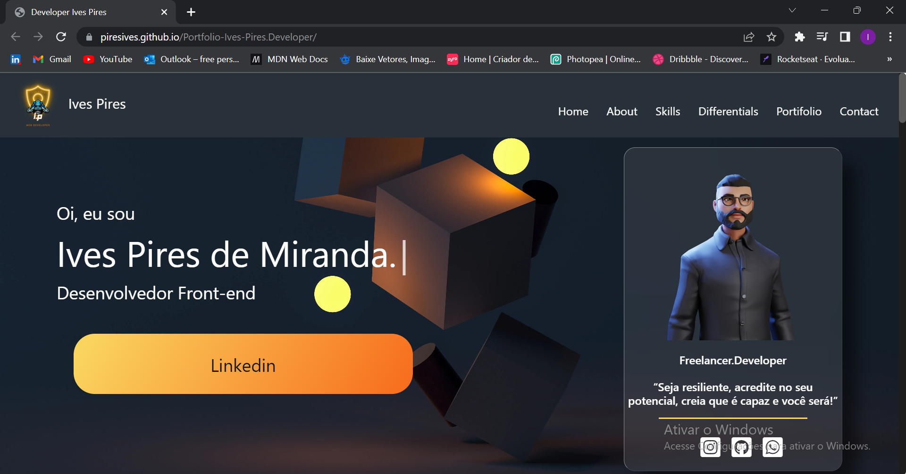
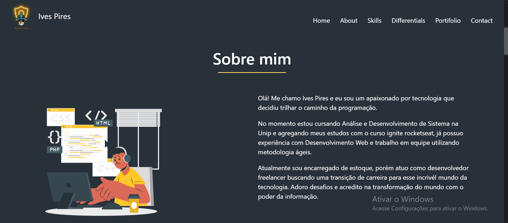
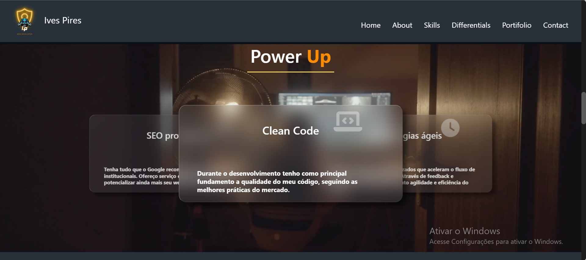
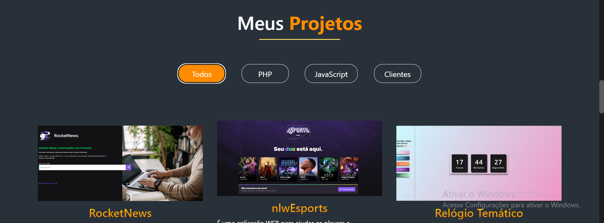
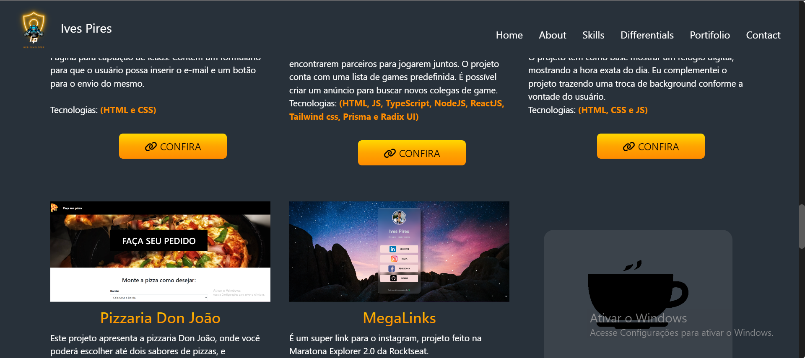
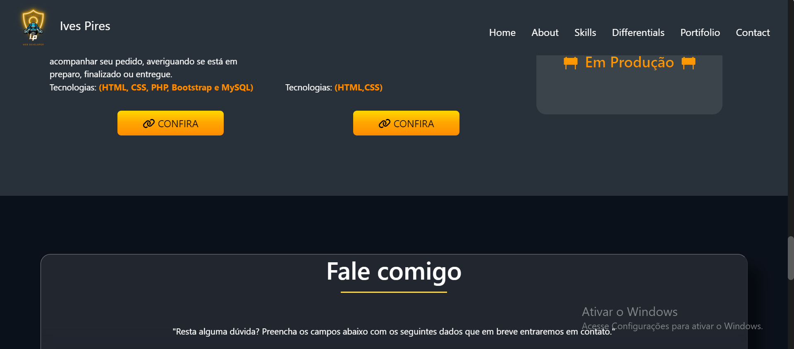
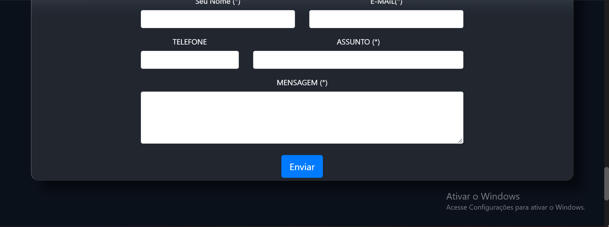
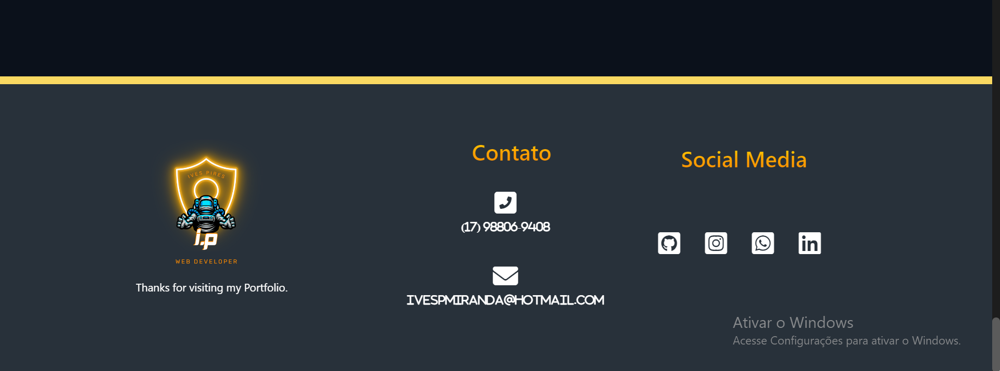

<h1 align="center">

</h1>
<h1 align="center">Portifólio | Ives Pires - Desenvolvedor Web 🚀</h1>

<a href="#Sobre">Sobre</a> |
<a href="#Layout">Layout</a> |
<a href="#Tecnologias">Tecnologias</a> |

<h2 id="Sobre">💻 Sobre</h2>

Portifólio - É uma aplicação WEB para mostrar meus projetos acadêmicos e profissionais.

 

<h2 id="Layout">🎨 Layout</h2>

Veja o Layout da aplicação a seguir

<h1 align="center">

</h1>

<h2 id="Tecnologias">🛠 Tecnologias</h2>

As seguintes tecnologias foram empregadas na criação deste projeto:

- [Vanilla-tilt.js](https://micku7zu.github.io/vanilla-tilt.js/)
- [bootstrap](https://getbootstrap.com/docs/4.0/getting-started/introduction/)
- [Javascript](https://developer.mozilla.org/pt-BR/docs/Web/JavaScript)
- [Scrollreveal.js](https://unpkg.com/scrollreveal@4.0.9/dist/scrollreveal.js)
- [Font Awesome](https://fontawesome.com/)

---
Made with 💚 by Ives Pires 👋 [See my LinkedIn](https://www.linkedin.com/in/ives-pires-de-miranda/)